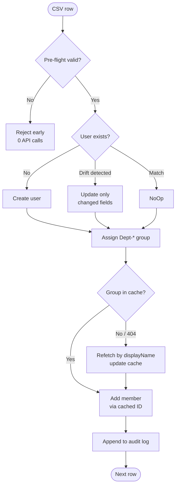

# M365 Automation Toolkit

> Production-style PowerShell scripts for daily Microsoft 365 administration
> via the Microsoft Graph API. Built and tested against a personal Entra ID
> tenant. Demonstrates idempotent reconciliation, retry on throttling,
> in-memory caching for eventual-consistency safety, and structured audit logs.

## Why this exists

Manually managing M365 environments -- creating users, auditing security
posture, offboarding employees -- consumes hours per week and is error-prone.
This toolkit turns those workflows into reproducible, auditable scripts.

It also exists as a reference for what "production-style" looks like at the
script level: pre-flight validation, retry with backoff, idempotency,
self-healing on stale cache, structured JSON audit logs.

## Headline metrics

| Operation | Manual | Automated | Speedup |
|---|---|---|---|
| Bulk user onboarding (10 users, full lifecycle) | ~30 min | **6.34 sec** | **284x** |
| Same operation, second run (NoOp / idempotent) | -- | **<5 sec** | -- |
| Pre-flight validation of a 10-row CSV | ~5 min | **<1 sec** | -- |
| Security posture audit (5 checks, 11 users) | ~4 hours (manual) | **5.03 sec** | **~2800x** |
| Employee offboarding (full lifecycle, 2 users) | ~1 hour (manual) | **~10 sec** | **~360x** |

Lifecycle covered per user: create account → set department/title → assign
license (when SKU available) → set manager → add to departmental security
group. All idempotent, all logged.

## Tech stack

- **PowerShell 7.x** (cross-platform: macOS, Linux, Windows)
- **Microsoft Graph SDK for PowerShell** (`Microsoft.Graph` v2.x)
- **Azure AD App Registration** with application permissions
- **JSON audit logs** for every operation

## Quick start

### 1. Prerequisites

- PowerShell 7+ (`pwsh`)
- An Entra ID tenant with admin access
- An App Registration with these Graph application permissions, all granted
  admin consent:
  - `User.ReadWrite.All`
  - `Group.ReadWrite.All`
  - `Directory.Read.All`
  - `AuditLog.Read.All`
  - `Organization.Read.All`

### 2. Install dependencies

```powershell
Install-Module Microsoft.Graph -Scope CurrentUser
Install-Module ImportExcel  -Scope CurrentUser
```

### 3. Authenticate

```powershell
./setup/Connect-M365.ps1
```

You will be prompted for Tenant ID, Client ID, and Client Secret Value.

### 4. Run

All operations go through a single entry point:

```powershell
./run.ps1 onboard -DryRun    # Preview onboarding (no changes)
./run.ps1 onboard            # Create users, assign groups/managers
./run.ps1 onboard            # Run again -> all NoOp (idempotent)
./run.ps1 audit              # Security posture audit -> JSON + Excel
./run.ps1 offboard -DryRun   # Preview offboarding
./run.ps1 offboard           # Disable, revoke sessions, remove groups
./run.ps1 validate           # Test pre-flight CSV validation
./run.ps1 clean              # Remove demo users
```

## Repository layout

```
m365-automation-toolkit/
├── CLAUDE.md                       # AI pair-programming instructions
├── README.md                       # this file
├── setup/
│   └── Connect-M365.ps1            # one-shot interactive auth
├── modules/
│   └── M365Helper/
│       └── Invoke-WithRetry.ps1         # exponential backoff for Graph 429/503
├── scripts/
│   ├── 01-bulk-onboarding/
│   │   ├── Test-OnboardingCsv.ps1       # pre-flight validation
│   │   ├── Invoke-UserOnboarding.ps1    # main: idempotent reconciliation
│   │   ├── New-BulkEntraUsers.ps1       # v1, kept for reference
│   │   ├── Remove-BulkEntraUsers.ps1    # cleanup
│   │   └── Remove-DuplicateGroups.ps1   # dedupe helper
│   ├── 02-security-audit/
│   │   └── Get-SecurityPosture.ps1      # 5-check security audit → JSON + Excel
│   └── 03-offboarding/
│       └── Invoke-UserOffboarding.ps1   # automated offboarding workflow
├── demo-data/
│   ├── new-hires-2026-05.csv            # 10 sample users
│   └── csv-invalid-example.csv          # deliberately broken, validation demo
├── docs/
│   ├── senior-review.md                 # gap analysis from a senior M365 POV
│   ├── architecture.md                  # design patterns deep-dive
│   └── sample-audit-log.json            # sanitized example output
├── tests/                               # Pester 5 tests
│   ├── Test-OnboardingCsv.Tests.ps1
│   └── Invoke-WithRetry.Tests.ps1
├── logs/                                # JSON audit logs (gitignored runtime artifacts)
│   └── .gitkeep
├── .github/
│   └── workflows/
│       └── ci.yml                       # PSScriptAnalyzer + Pester
├── run.ps1                              # Single entry point for all operations
├── CLAUDE.md                            # AI pair-programming instructions
├── CONTRIBUTING.md
└── LICENSE
```

## Design highlights

### 1. Pre-flight validation

`Test-OnboardingCsv.ps1` runs before any API call. It checks:

- Required columns exist
- No duplicate `MailNickname` rows
- `MailNickname` matches the UPN naming convention
- `Department` is in a whitelist
- `UsageLocation` is a valid ISO 3166-1 alpha-2 code

Bad input never reaches the API.

```
=== Validation Result ===
IsValid: False
Errors found: 5
  - Duplicate MailNickname in CSV: john.smith (appears 2 times)
  - Row 2: empty value in column 'DisplayName'
  - Row 5: invalid MailNickname 'JOHN_BAD' (use lowercase letters, digits, dots)
  - Row 6: invalid Department 'UnknownDept'
  - Row 7: invalid UsageLocation 'XX'
```

### 2. Retry with exponential backoff

`Invoke-WithRetry` wraps every Graph mutation. It:

- Honors the `Retry-After` header on HTTP 429 / 503
- Falls back to exponential backoff with jitter
- Re-throws non-throttling errors immediately

### 3. Idempotent reconciliation

The main script (`Invoke-UserOnboarding.ps1`) treats the CSV as desired state.
For each row it determines whether to **CREATE**, **UPDATE** (only the drifted
fields), or **NoOp**. Running the same CSV twice produces zero side effects
on the second run.

This is the same philosophy as Terraform `apply`.

### 4. Eventual consistency safety

Microsoft Graph is a distributed system. Filter indexes lag for several
seconds in both directions:

- A freshly-created group may not appear in the filter index (CREATE lag)
- A deleted group may still appear in the filter index (DELETE lag)

The script handles this with two patterns:

1. **In-memory cache** populated once at the start of the run, sorted by
   `CreatedDateTime` ASC and deduped by name. The cache is the source of
   truth for the duration of the run.
2. **Self-healing retry**: if `New-MgGroupMember` returns `404
   Request_ResourceNotFound`, the loop refetches the group by name,
   updates the cache, and retries.

This was discovered the hard way; see the debugging story in
`docs/senior-review.md`.

### 5. Structured audit logs

Every run produces a timestamped JSON file under `./logs/`:

```json
{
  "Version": "2.0",
  "RunTimestamp": "2026-04-10T16:47:36+09:00",
  "DurationSec": 6.34,
  "Domain": "contoso.onmicrosoft.com",
  "TotalUsers": 10,
  "CreatedCount": 0,
  "UpdatedCount": 0,
  "NoOpCount": 10,
  "FailCount": 0,
  "Results": [
    {
      "DisplayName": "Minsu Kim",
      "UserPrincipalName": "minsu.kim@contoso.onmicrosoft.com",
      "Status": "NoOp",
      "Actions": "noop",
      "Timestamp": "2026-04-10T16:47:36+09:00"
    }
  ]
}
```

These are intentionally machine-readable so they can be ingested by SIEM,
Splunk, or used as compliance evidence.

## Architecture diagrams

### Decision tree per user (idempotent reconciliation)



### Eventual-consistency self-healing (group membership)

```mermaid
sequenceDiagram
    participant Loop as Onboarding loop
    participant Cache as In-memory group cache
    participant Graph as Microsoft Graph API

    Note over Cache,Graph: Cache pre-loaded ONCE at run start<br/>(sorted by CreatedDateTime ASC, deduped by name)

    Loop->>Cache: Find "Dept-Marketing"
    Cache-->>Loop: cached group ID
    Loop->>Graph: New-MgGroupMember(cached ID)

    alt Cache stale (group recreated since pre-load)
        Graph-->>Loop: 404 Request_ResourceNotFound
        Loop->>Graph: List groups by displayName
        Graph-->>Loop: Latest group ID
        Loop->>Cache: Update entry
        Loop->>Graph: Retry New-MgGroupMember
        Graph-->>Loop: 204 No Content
    else Cache fresh
        Graph-->>Loop: 204 No Content
    end
```

For deeper design rationale (trade-offs, alternatives, what would change in production), see [`docs/architecture.md`](docs/architecture.md).

## What this is NOT (and why)

This project deliberately uses interactive `Read-Host` for the Client Secret
because it runs in a developer sandbox. **In production environments the
recommended patterns are:**

- **CI/CD**: GitHub Actions with OIDC federation to Entra ID -- no secret at all
- **Scheduled**: Azure Function with Managed Identity + Key Vault reference
- **On-premises**: Service Principal with certificate auth, never client secret

See `docs/senior-review.md` for the full production gap analysis.
The interactive auth is a deliberate trade-off, not an oversight.

## Sample output: Onboarding

```
=== User Onboarding (v2) ===
Validation OK (10 rows)
Domain: contoso.onmicrosoft.com
Cached 5 existing Dept-* groups
Processing 10 users...

  [NoOp] Minsu Kim -- noop
  [NoOp] Jiyoung Park -- noop
  [NoOp] Sungho Lee -- noop
  [NoOp] Hyeri Choi -- noop
  [NoOp] Dongwook Jung -- noop
  [NoOp] Yujin Han -- noop
  [NoOp] Taehyun Seo -- noop
  [NoOp] Soyoung Im -- noop
  [NoOp] Jaehoon Oh -- group-added:Dept-Marketing
  [NoOp] Eunji Bae -- group-added:Dept-Marketing

=== Summary ===
  Total: 10 | Created: 0 | Updated: 0 | NoOp: 10 | Failed: 0
  Duration: 6.34s
```

A sanitized sample audit log is available at [`docs/sample-audit-log.json`](docs/sample-audit-log.json).

## Script: Security Posture Audit

`Get-SecurityPosture.ps1` performs five automated security checks:

| Check | What it detects | Severity |
|---|---|---|
| MFA registration | Active users without MFA | High |
| Inactive accounts | No sign-in for 90+ days (or creation age on free tenants) | Medium |
| Privileged roles | Global Admin, User Admin, Security Admin, etc. | Critical |
| Guest accounts | External B2B users | Low |
| Password policy | Accounts with password-never-expires | Medium |

Outputs: console summary, JSON audit log, and Excel workbook with one sheet
per finding category. Gracefully degrades on free Entra ID tenants (no
`SignInActivity` → falls back to `CreatedDateTime`).

```
./audit.ps1          # Full audit → Console + JSON + Excel
./audit-dry.ps1      # Preview checks without querying Graph
```

## Roadmap

- [x] **Day 1 v1** -- basic onboarding + cleanup
- [x] **Day 1 v2** -- pre-flight validation, retry, idempotency, license/group/manager
- [x] **Day 1 v2.1** -- fixed eventual-consistency bug with cache + self-healing
- [x] **CLAUDE.md** -- project-level instructions for AI pair programming
- [x] **Day 2** -- security posture audit (5 checks, JSON + Excel output, free-tier graceful degradation)
- [x] **Day 3** -- automated offboarding (disable, revoke sessions, remove groups/manager, retention group)
- [x] **v2.2** -- Pester 5 unit tests + PSScriptAnalyzer lint + CI three-stage pipeline (syntax / lint / test)
- [ ] **v3** -- replace interactive auth with `SecretManagement`, add `$batch` endpoint for bulk Graph operations, Pester integration tests against a sandbox tenant

## How this was built

Built as a portfolio project with Claude as a pair programmer. The
architectural decisions, debugging, and pattern selection were mine; Claude
accelerated the typing and helped me look up Graph SDK syntax. The most
interesting moment was diagnosing an eventual-consistency bug in group
membership operations -- documented in `docs/senior-review.md`.

## License

MIT

## Author

Byeongki "Ki" Cho -- bilingual cloud and infrastructure engineer in Seoul.
[LinkedIn](https://www.linkedin.com/in/byeongkicho)
